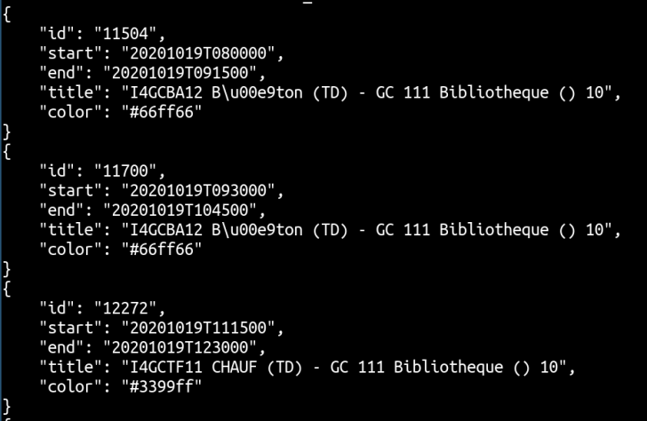
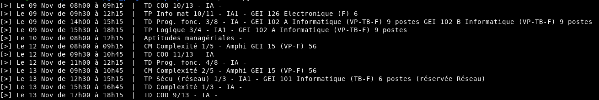

# API Python Plannex

API Python to retreive Plannex informations

---

## Requirements

Pour installer les dépendances :

```
python3 -m pip install -r requirements.txt
```

## Données retournées

En sortie, les informations sont présentes au format JSON :



Les données contiennent l'`id` du cours, les dates de début et de fin du cours, (`start`, `end`), et le titre (`title`) du cours.

```json
...
{
    "id": "18518",
    "start": "20201021T080000",
    "end": "20201021T091500",
    "title": "CM POO 5/6 - distanciel -",
    "color": "#e294ff"
},
{
    "id": "18681",
    "start": "20201021T093000",
    "end": "20201021T104500",
    "title": "CM Logique - distanciel 13/13 -",
    "color": "#99ffff"
},
{
    "id": "16975",
    "start": "20201021T140000",
    "end": "20201021T151500",
    "title": "CM Interco r\u00e9seaux 10/12 - Amphi Fourier (VP-TB-F) 56",
    "color": "#ffccff"
}
...
```

## Exemple

Voici un script de test pour lister les cours de 4A IR d'une semaine :



Le script : [example_script.py](./example_script.py)


## Licenses

Ce projet est mis à disposition sous licence GPLv2.0.
